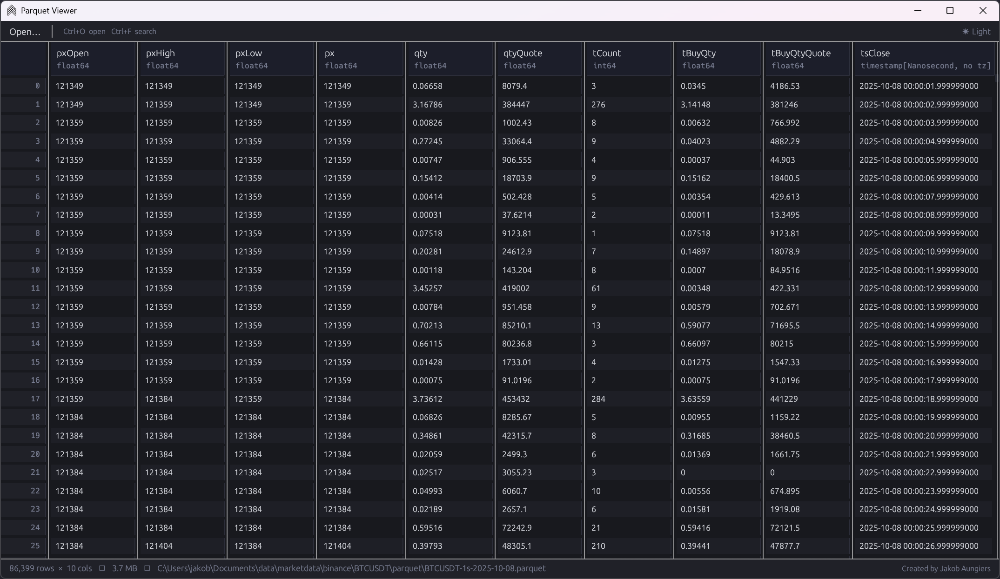
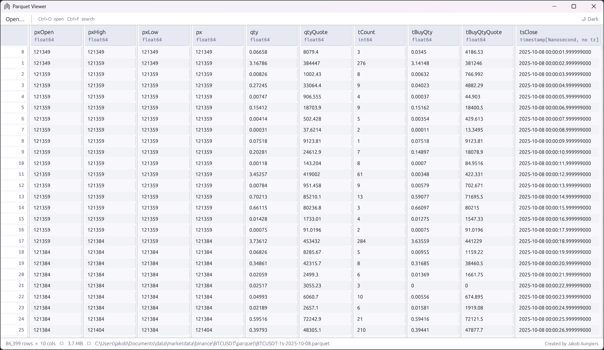

# Fast Parquet Viewer

A fast, lightweight desktop viewer for `.parquet` files, built with Rust and [egui](https://github.com/emilk/egui).
Has a modern interface that opens extremely fast and can be bound to .parquet files to make it the default app for opening parquet files.

Windows binary available and compiled under `target/release/FastParquetViewer.exe`.





## Features

- **Drag & drop** a `.parquet` or `.parq` file onto the window to open it
- **File dialog** via the `Open…` button or `Ctrl+O`
- **Virtual scrolling** — handles large files without loading the full table into view at once
- **Column sorting** — click any column header to sort ascending/descending (numeric-aware)
- **Search / filter** — `Ctrl+F` to filter rows by any matching cell value, with match highlighting
- **Schema display** — column names and data types shown in the header
- **Status bar** — shows row/column count and file size
- **CLI support** — pass a file path as an argument: `ParquetViewer.exe data.parquet`
- Dark theme

## Download

Download the latest `FastParquetViewer.exe` from the [Releases](../../releases) page. It is a single self-contained executable — no installer or additional files required.

## Building from source

Requires [Rust](https://rustup.rs/) (stable).

```sh
git clone https://github.com/jaungiers/Fast-Parquet-Viewer
cd Fast-Parquet-Viewer
cargo build --release
```

## macOS app and Finder integration

Build the app bundle on your Mac (requires `cargo-bundle` 0.12 or later):

```sh
cargo install cargo-bundle --locked
cargo bundle --release --bin FastParquetViewer --format osx
open target/release/bundle/osx
```

Quit any older copy, then drag **Fast Parquet Viewer.app** from that folder into
**Applications**, replacing the previous version. Remove an older
`parquet_viewer.app` if you installed one under that name.

The bundle registers `.parquet` and `.parq` documents. Finder's **Open With** and
double-click requests work both at launch and while the app is running. To make
it the default, select a Parquet file in Finder, choose **Get Info → Open with →
Fast Parquet Viewer → Change All…**. Repeat for `.parq` if needed.

If Finder still shows the old file-type information after replacing the app,
refresh its registration:

```sh
/System/Library/Frameworks/CoreServices.framework/Frameworks/LaunchServices.framework/Support/lsregister -f "/Applications/Fast Parquet Viewer.app"
```

The viewer displays one document at a time. When opening a selection of files,
it uses the first supported file. Command-line filenames and dropping files into
the app window remain supported.

### macOS regression checks

```sh
cargo test --bin FastParquetViewer
cargo test --test macos_open_documents
```

The second test requires a logged-in macOS desktop session. It runs AppKit's
launch lifecycle before dispatching real open-document Apple events, checking
that both the initial document and later requests reach the viewer. This catches
handlers registered too early and then replaced by AppKit during startup.

## Dependencies

| Crate | Purpose |
|---|---|
| [eframe](https://github.com/emilk/egui/tree/master/crates/eframe) / [egui](https://github.com/emilk/egui) | GUI framework |
| [egui_extras](https://github.com/emilk/egui/tree/master/crates/egui_extras) | Virtual-scroll table widget |
| [arrow](https://github.com/apache/arrow-rs) | Column data model |
| [parquet](https://github.com/apache/arrow-rs/tree/master/parquet) | Parquet file reading |
| [rfd](https://github.com/PolyMeilex/rfd) | Native file dialog |

## Author
Jakob Aungiers
